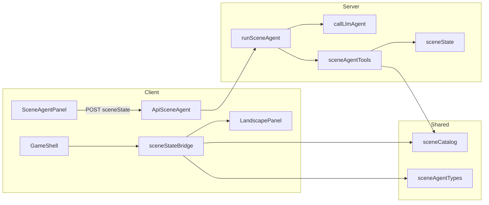

# Scene agent

Guide to the Lost History **scene agent**: an LLM-driven workflow that manipulates a serializable 2.5D landscape using **catalog-only** function calling. Models choose predefined objects by `catalogId`; they cannot invent voxel data or new object types.

See [scene.md](./scene.md) for the doc index. Renderer internals live in [../src/landscape-display/ARCHITECTURE.md](../src/landscape-display/ARCHITECTURE.md).

---

## Architecture



1. **Client** holds `LandscapeSceneState` in React (`GameShell`).
2. **`POST /api/scene-agent`** sends that state plus a prompt (or full `messages`) to the server.
3. **`runSceneAgent`** clones/normalizes state, wires tool handlers, and runs **`callLlmAgent`** (multi-step tool loop).
4. Tool handlers mutate the in-memory state via **`server/scene/scene-state.ts`**.
5. Response includes updated **`sceneState`**; the client rebuilds a **`LandscapeSceneSnapshot`** and applies viewer/sun controls to the Three.js controller.

---

## File map

| Path | Role |
|------|------|
| [`shared/scene-agent-types.ts`](../shared/scene-agent-types.ts) | `LandscapeSceneState`, `PlacedInstance`, defaults (`createDefaultSceneState`) |
| [`shared/scene-catalog.ts`](../shared/scene-catalog.ts) | `SCENE_OBJECT_CATALOG`, `getCatalogEntry`, `listCatalogEntries` |
| [`server/scene/scene-state.ts`](../server/scene/scene-state.ts) | Pure mutations: place, move, remove, background, viewer, sun |
| [`server/scene/scene-agent-tools.ts`](../server/scene/scene-agent-tools.ts) | Tool declarations, handlers, `SCENE_AGENT_SYSTEM_INSTRUCTION` |
| [`server/scene/run-scene-agent.ts`](../server/scene/run-scene-agent.ts) | `runSceneAgent()` → `callLlmAgent` |
| [`server/app.ts`](../server/app.ts) | `POST /api/scene-agent` |
| [`src/game/scene-state-bridge.ts`](../src/game/scene-state-bridge.ts) | `sceneStateToSnapshot`, `applySceneControls` |
| [`src/game/default-scene.ts`](../src/game/default-scene.ts) | Initial client state |
| [`src/game/GameShell.tsx`](../src/game/GameShell.tsx) | Viewport + scene state ownership |
| [`src/game/SceneAgentPanel.tsx`](../src/game/SceneAgentPanel.tsx) | Chat UI, HTTP calls, model picker |

---

## `LandscapeSceneState`

Serializable state shared between client and server (JSON-safe).

| Field | Type | Notes |
|-------|------|--------|
| `backgroundUrl` | `string` | Panoramic background (e.g. `/landscapes/default.svg`) |
| `horizonRatio` | `number?` | Horizon position 0–0.5; optional |
| `instances` | `PlacedInstance[]` | Placed catalog objects |
| `viewer` | `SceneViewerState` | `positionX`, `headYaw`, `headPitch` |
| `sun` | `SceneSunState` | `azimuth` (0–360°), `elevation` (0–90°) |

Each **`PlacedInstance`**:

| Field | Notes |
|-------|--------|
| `instanceId` | Unique per scene (e.g. `candle_1`) |
| `catalogId` | Must exist in catalog |
| `position` | `{ x, depth, elevation }` in meters |
| `heightMeters` | Optional; defaults from catalog |

Defaults from **`createDefaultSceneState()`**:

- `backgroundUrl`: `/landscapes/default.svg`
- `instances`: `[]`
- `viewer`: `{ positionX: 0, headYaw: 0, headPitch: 0 }`
- `sun`: `{ azimuth: 180, elevation: 45 }`

Server entry normalizes input with **`prepareSceneStateForAgent()`** (`clone` + **`normalizeSceneState()`**).

---

## Coordinate semantics

Agent and server tools use the same placement axes as the landscape renderer (see [ARCHITECTURE.md](../src/landscape-display/ARCHITECTURE.md)):

| Axis | Meaning |
|------|---------|
| **`x`** | Lateral offset in meters (left/right from center) |
| **`depth`** | Distance **into** the scene in meters (positive; world −Z) |
| **`elevation`** | Vertical height in meters |

**Rules enforced on the server:**

- `depth` must be **> 0** for `place_instance` and `move_instance`
- Unknown `catalogId` → error (call `list_available_objects` first)
- Duplicate `instanceId` → error

**Placement range:** `get_placement_limit(depth)` uses **`estimatePlacementLimit()`** in `scene-state.ts` (rough slice width from a 21:9 background assumption). The live renderer may refine limits after the background loads via `getMaxLateralRange` / `getWorldPlacementLimit`.

**Viewer / head / sun** (clamped on apply):

- Viewer X: clamped to estimated walk range
- Head yaw: ±30°, pitch: 0–15°
- Sun elevation: 0–90°

Frozen constants exposed in `get_scene_info` (not changeable via tools): `humanHeight`, `backgroundDistance`, `virtualDistance`, max head angles.

---

## Object catalog

Defined in [`shared/scene-catalog.ts`](../shared/scene-catalog.ts). Current entries:

| `catalogId` | Display name | Default height (m) |
|-------------|--------------|-------------------|
| `example_prop` | Example prop | 2.0 |
| `red_candle` | Red candle | 0.4 |
| `ancient_scroll` | Ancient scroll | 0.25 |
| `silver_inkwell` | Silver inkwell | 0.35 |

**Agent tools never receive voxel arrays.** `list_available_objects` returns `catalogId`, `displayName`, `description`, and `defaultHeightMeters` only.

**Client rendering** resolves voxels via `getCatalogEntry()` in [`scene-state-bridge.ts`](../src/game/scene-state-bridge.ts) and builds meshes through the landscape voxel adapter.

### Adding a catalog object

1. Add a `SceneObjectCatalogEntry` to `SCENE_OBJECT_CATALOG` (voxels + metadata).
2. Run `npm test -- tests/unit/scene-agent-tools.test.ts` (and integration scene tests if you change API behavior).
3. Agents discover the new id via `list_available_objects` on the next run.

---

## Agent tools

Handlers live in **`createSceneToolHandlers(state)`** in [`scene-agent-tools.ts`](../server/scene/scene-agent-tools.ts). Mutations update the same `state` object for the duration of the agent run.

### Read-only

| Tool | Parameters | Returns |
|------|------------|---------|
| `list_available_objects` | — | `{ objects: [{ catalogId, displayName, description, defaultHeightMeters }] }` |
| `list_placed_instances` | — | `{ instances: [{ instanceId, catalogId, position, heightMeters }] }` |
| `get_scene_info` | — | Background, horizon, instance count, viewer, sun, frozen constants |
| `get_placement_limit` | `depth` (required), `buffer?` | `{ depth, estimatedMaxLateralMeters, note }` or `{ error }` |

### Mutations

| Tool | Parameters | Backend | Success / failure |
|------|------------|---------|-------------------|
| `place_instance` | `instanceId`, `catalogId`, `x`, `depth`, `elevation`, `heightMeters?` | `placeInstance` | `{ ok: true, instance }` or `{ error }` |
| `move_instance` | `instanceId`, `x`, `depth`, `elevation` | `moveInstance` | `{ ok: true }` or `{ error }` |
| `remove_instance` | `instanceId` | `removeInstance` | `{ ok: true }` or `{ error }` |
| `clear_instances` | — | `clearInstances` | `{ ok: true, instanceCount: 0 }` |
| `set_background` | `url` | `setBackground` | `{ ok: true, backgroundUrl }` or `{ error }` |
| `set_viewer_position` | `x` | `setViewerPosition` | `{ ok: true, positionX }` (clamped) |
| `set_head_look` | `yaw`, `pitch` | `setHeadLook` | `{ ok: true, headYaw, headPitch }` (clamped) |
| `set_sun_position` | `azimuth`, `elevation` | `setSunPosition` | `{ ok: true, sun }` |

The agent loop also receives the shared **`submit_final_answer`** tool from `callLlmAgent` (see [llm-usage.md](./llm-usage.md#agent-conventions-verify-before-finish)).

---

## Mutation layer (`scene-state.ts`)

Pure functions mutating `LandscapeSceneState` in place:

| Function | Behavior |
|----------|----------|
| `placeInstance` | Validates catalog, height, unique `instanceId`, `depth > 0`; pushes instance |
| `moveInstance` | Updates position of existing instance |
| `removeInstance` | Splices by `instanceId` |
| `clearInstances` | Empties `instances` |
| `setBackground` | Non-empty trimmed URL |
| `setViewerPosition` | Clamps X to walk range |
| `setHeadLook` | Clamps yaw/pitch |
| `setSunPosition` | Clamps elevation 0–90° |
| `cloneSceneState` / `normalizeSceneState` | Copy + defaults for agent prep |
| `estimatePlacementLimit` | Server-side lateral range estimate at depth |

---

## Agent run (`runSceneAgent`)

```ts
// server/scene/run-scene-agent.ts
runSceneAgent({
  sceneState,           // required
  prompt?,              // or messages[]
  model?,               // registry key; must support function calling
  speedTier?,           // default 'moderate' if model omitted
  maxSteps?,            // default 12
  debug?,               // include native provider payloads
});
```

- **`SCENE_AGENT_SYSTEM_INSTRUCTION`** — catalog-only rules, placement workflow, verify-before-finish (retry on tool errors, confirm with `list_placed_instances`, then `submit_final_answer`).
- Wired into **`callLlmAgent`** with `SCENE_AGENT_TOOL_DECLARATIONS` and handlers from **`createSceneToolHandlers`**.
- Returns **`CallLlmAgentResult`** plus final **`sceneState`** (cloned from mutated state).

**Model requirements:** explicit `model` must have **`supportsFunctionCalling: true`**. Groq Compound models (`groq--compound-off`, `groq--compound-mini-off`) are disabled in the game UI because they use Groq built-in tools, not local scene handlers.

**Verify-before-finish:** Same conventions as generic agents in [llm-usage.md](./llm-usage.md#agent-conventions-verify-before-finish). Scene-specific text is in `SCENE_AGENT_SYSTEM_INSTRUCTION`.

---

## HTTP API: `POST /api/scene-agent`

**Body:**

| Field | Required | Notes |
|-------|----------|-------|
| `sceneState` | yes | Full `LandscapeSceneState` |
| `prompt` or `messages` | one required | For follow-ups, send full `messages` including the new user turn |
| `model` | no | Registry id (e.g. `gemini-3.1-flash-lite-low`); must support function calling |
| `speedTier` | no | Used when `model` omitted (default `moderate` in `runSceneAgent`) |
| `maxSteps` | no | Default 12 |
| `debug` | no | Dev: native provider payloads in response |

**Response:** `CallLlmAgentResult` fields plus **`sceneState`** (updated). Check `registryKey` / `modelsAttempted` if failover changed the model.

**Errors:** `400` if `sceneState` or prompt/messages missing; `500` with `{ error }` on failure.

**Example:**

```bash
curl -s http://localhost:3001/api/scene-agent \
  -H "Content-Type: application/json" \
  -d '{
    "prompt": "Place a red candle at depth 15m, x offset 1m",
    "model": "gemini-3.1-flash-lite-low",
    "sceneState": {
      "backgroundUrl": "/landscapes/default.svg",
      "instances": [],
      "viewer": { "positionX": 0, "headYaw": 0, "headPitch": 0 },
      "sun": { "azimuth": 180, "elevation": 45 }
    }
  }'
```

Model list: **`GET /api/models`** (game UI filters to function-calling models).

---

## Client flow

**[`GameShell.tsx`](../src/game/GameShell.tsx)**

- `useState<LandscapeSceneState>(defaultSceneState)`
- `sceneStateToSnapshot(sceneState)` → props for **`LandscapePanel`**
- `applySceneControls(controller, sceneState)` on ready and when viewer/sun change
- **`SceneAgentPanel`** receives `sceneState`, `onSceneStateChange`, `onAgentComplete`

**[`SceneAgentPanel.tsx`](../src/game/SceneAgentPanel.tsx)**

- POSTs to `/api/scene-agent` with current `sceneState` and conversation
- On success, updates state from `response.sceneState`
- Optional model override and debug / model-context viewer

**[`scene-state-bridge.ts`](../src/game/scene-state-bridge.ts)**

- **`sceneStateToSnapshot`**: maps each instance to voxel mesh input via catalog
- **`applySceneControls`**: `setViewerPosition`, `setHeadLook`, `setSunPosition` on `LandscapeSceneController`

Instance placement/removal in the 3D view is driven by the **snapshot** diff in `LandscapePanel`, not by direct tool calls on the client.

---

## Tests

| File | Covers |
|------|--------|
| [`tests/unit/scene-agent-tools.test.ts`](../tests/unit/scene-agent-tools.test.ts) | Handlers: catalog list (no voxels), place/move/remove errors |
| [`tests/integration/scene-agent.mock.test.ts`](../tests/integration/scene-agent.mock.test.ts) | HTTP route, `sceneState` required, mocked agent response |

Run: `npm test -- tests/unit/scene-agent-tools.test.ts tests/integration/scene-agent.mock.test.ts`

---

## Related docs

- [scene.md](./scene.md) — doc index
- [llm-usage.md](./llm-usage.md) — `callLlmAgent`, `submit_final_answer`, generic agent conventions
- [llm-internals.md](./llm-internals.md) — model registry, speed tiers, failover
- [../src/landscape-display/ARCHITECTURE.md](../src/landscape-display/ARCHITECTURE.md) — renderer API and coordinates
